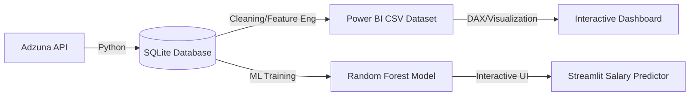

# 📊 Real-Time Job Market Intelligence Dashboard (India Focus)

[](https://www.python.org/)
[](https://www.sqlite.org/)
[](https://powerbi.microsoft.com/)
[](https://opensource.org/licenses/MIT)

An end-to-end data analytics project that scrapes, cleans, and visualizes job market data specifically for **Data Analytics roles in India**. This project leverages the **Adzuna API** to fetch live job postings and transforms them into actionable business insights.

---

## 👤 Author
**Gouri Vishwakarma**
- [GitHub](https://github.com/GouriVishwakarma)
- [LinkedIn](https://www.linkedin.com/in/gouri-vishwakarmaa)

---

## 🎯 Project Overview

In a rapidly shifting job market, staying ahead means knowing exactly which skills are in demand. This project was built to answer:
- Which technical skills (Python, SQL, Power BI, etc.) are most requested for Data Analysts in India?
- How does the demand for these skills change across different experience levels?
- What are the salary trends for remote vs. on-site roles?

### 🏗️ Data Architecture


---

## 🛠️ Tech Stack & Tools

- **Data Collection**: Python + `requests` (Adzuna API)
- **Data Processing**: Pandas, NumPy
- **Machine Learning**: Scikit-Learn (Random Forest), Joblib
- **Web App**: Streamlit (for real-time salary prediction)
- **Automation**: GitHub Actions (Weekly Data Refresh)
- **Database**: SQLite
- **Visualization**: Power BI Desktop

---

## 📊 Dashboard Preview


*Figure 1: India Job Market Overview - Trends in job roles, locations, and experience levels.*


*Figure 2: Skills Demand Analysis - Most in-demand technical skills for data roles.*


*Figure 3: Salary Trends & Compensation Insights - Pay scales by role and location.*

---

## 🚀 Key Features & Insights

### 1. Advanced Feature Engineering
Our pipeline doesn't just store raw data. It extracts hidden value:
- **Skill Extraction**: uses NLP/Regex to flag 10+ specific technical skills from job descriptions.
- **Experience Categorization**: Maps messy text into standard buckets (Fresher, Junior, Senior).
- **Work Setting Classification**: Automatically detects "Remote," "Hybrid," or "On-Site."

### 2. High-Impact EDA
Initial analysis revealed:
- **Top Skill**: SQL and Python consistently appear in >50% of job postings.
- **Experience Gap**: The majority of hiring focuses on Junior (1-3 yrs) roles.
- **Remote Trend**: Remote roles often offer a 15-20% higher average salary than on-site equivalents.

---

## 🧠 Machine Learning: Salary Predictor

We've integrated a **Random Forest Regressor** model to provide real-time salary estimates based on live market data.

- **Objective**: Predict annual salary based on job characteristics.
- **Features**: Skill set (Python, SQL, etc.), Location, Experience Level, and Work Setting (Remote/On-site).
- **Interactive App**: Users can input their profile (skills, city, experience) into the **Streamlit** dashboard to get an instant salary prediction.

---

## 💻 Interactive Web App (Streamlit)

### How to Run Locally:
```bash
streamlit run src/app.py
```

### Features:
- **Real-time Predictions**: Instantly see how adding a new skill (like Spark or AWS) impacts your market value.
- **Dynamic Inputs**: Select your location, experience level, and tech stack.
- **Market Insights**: Integrated pro-tips based on current data trends.

---

## ⚙️ Setup & Installation

### 1. Prerequisites
- [Python 3.8+](https://www.python.org/downloads/)
- [Adzuna API Credentials](https://developer.adzuna.com/) (Free tier available)
- Power BI Desktop (for viewing the `.pbix` file)

### 2. Clone the Repository
```bash
git clone https://github.com/GouriVishwakarma/job_market_dashboard.git
cd job_market_dashboard
```

### 3. Environment Setup
Create a `.env` file from the example:
```bash
cp .env.example .env
```
Add your `ADZUNA_APP_ID` and `ADZUNA_APP_KEY`.

### 4. Install Dependencies
```bash
pip install -r requirements.txt
```

---

## 📂 Project Structure

```text
job_market_dashboard/
├── .github/workflows/       # Automated weekly data refresh
├── data/                    # SQLite database and cleaned CSV exports
├── docs/screenshots/        # Dashboard preview images
├── models/                  # Trained ML model and feature metadata
├── notebooks/               # EDA & ML Training scripts
├── src/                     # Production scripts (Collection, Cleaning, App)
├── requirements.txt         # Project dependencies
├── Job_market_analysis.pbix # Final Power BI Dashboard
└── README.md                # Project documentation
```

---

## 🤝 Contributing
Contributions are welcome! Please see [CONTRIBUTING.md](CONTRIBUTING.md) for details.

---

## 📜 License
This project is licensed under the MIT License - see the [LICENSE](LICENSE) file for details.

---

## 🤝 Contributing
Contributions are welcome! If you'd like to improve the skill extraction logic or add new visualizations, feel free to fork this repo and submit a PR.

---

## 📜 License
This project is licensed under the MIT License.
